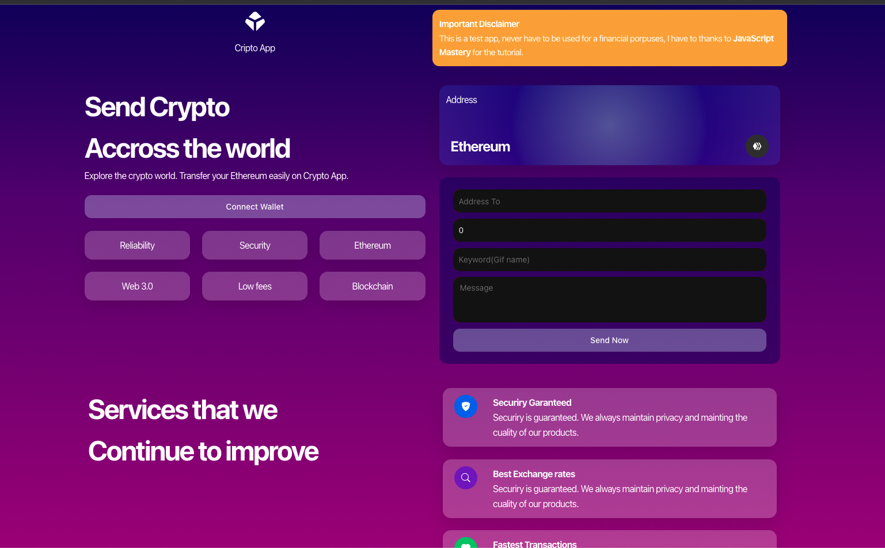
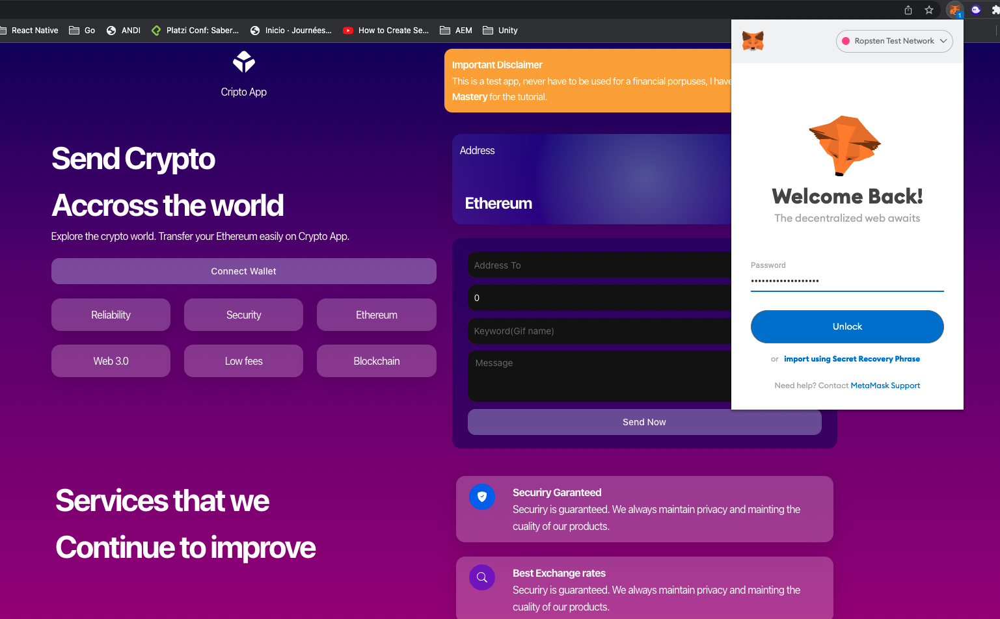
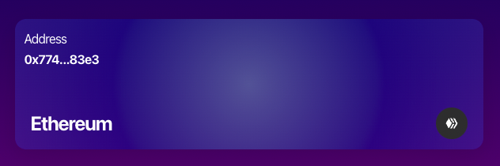
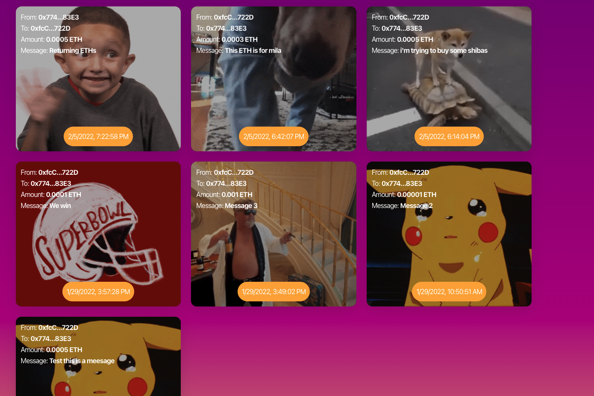

# Basic Web 3.0 App

This project is followed by [JavaScript Mastery](https://www.youtube.com/c/JavaScriptMastery) youtube tutorial, i make this app implemented **typescript** and using the new UI framework [**NextUI**](https://nextui.org/)

## Application usage

This application allows you to send and receive cryptos mainly **Ethereums**, you have to get installed at least [meta mask](https://metamask.io/), this ETH works in the ropsten testnet network, so you only be able to make transactions by this network.

## Screenshots

